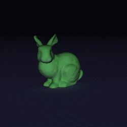

# CERES Ray Tracer (CRT) Demos

This repository contains some demo files for the [CERES Ray Tracer](https://github.com/ceres-navigation/ceres-raytracer).  Install that first (either from source, or directly for PyPI) before running any of these.

The python API allows for both "static" and "dynamic" scenes.
- **Dynamic:** The BVH is constructed from scratch every time a frame needs to be rendered.  This increases the total rendering time however it allows you to modify each loaded 3d geometry in-between frame renderings.
- **Static:** The BVH is constructed once allowing for faster overall render times.  The downside is that none of the geometries can be modified.

## Cornell Box with Render Passes:
```
python cornell_box.py
```
Doing so will produce four images:
- `cornell_box.png`: The rendered image
- `cornell_box_depth.png`: A pass containing the distance to each ray intersection
- `cornell_box_instance.png`: A pass where each color indicates a different object
- `cornell_box_normals.png`: A pass where each pixel is colored by the normal vector of the intersected point


## Stanford Bunny Animation:
```
python bunny.py
```
Doing so will produce an image sequence of a light moving around the stanford bunny.



***
## Contact
All questions, comments, and concerns should be directed to Chris Gnam: crgnam@buffalo.edu
