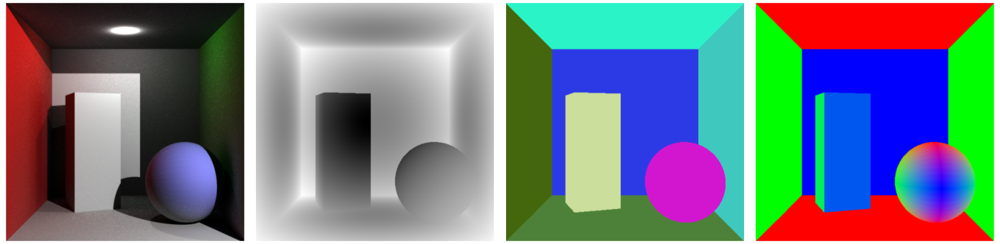
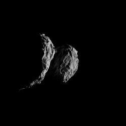

# CERES Ray Tracer (CRT) Demos

This repository contains some demo files for the [CERES Ray Tracer](https://github.com/ceres-navigation/ceres-raytracer).  Install that first (either from source, or directly for PyPI) before running any of these.

The python API allows for both "static" and "dynamic" scenes.
- **Dynamic:** The BVH is constructed from scratch every time a frame needs to be rendered.  This increases the total rendering time however it allows you to modify each loaded 3d geometry in-between frame renderings.
- **Static:** The BVH is constructed once allowing for faster overall render times.  The downside is that none of the geometries can be modified.

## Cornell Box with Render Passes:
```
python cornell_box.py
```
This script will produce 4 images in a new sub directory named `output_cornell_box`:
- `render.png`: The rendered image
- `depth.png`: A pass containing the distance to each ray intersection
- `instance.png`: A pass where each color indicates a different object
- `normals.png`: A pass where each pixel is colored by the normal vector of the intersected point




## ROSETTA Mission Animation
This script requires flight data from the ROSETTA mission available from the [Planetary Data System Navigation Node for ROSETTA](https://naif.jpl.nasa.gov/pub/naif/ROSETTA/kernels/).  This is not a tutorial on how to use [SPICE](https://naif.jpl.nasa.gov/naif/toolkit.html), so if you are unfamiliar, simply make sure to download all of the required files below.  If you're on a system that can run bash scripts, you can download this data by simply running:
```
cd kernels/
./get_kernels.sh
```

If you cannot run a bash script on your system (for example, if you are on Windows without WSL), you must manually download the following SPICE kernels:

| Link to File | Description | Location to put it |
| ------------ | ----------- | ------------------ |
| [CATT_DV_257_03_______00344.BC](https://naif.jpl.nasa.gov/pub/naif/ROSETTA/kernels/ck/CATT_DV_257_03_______00344.BC) | Attitude kernel (CK) for Comet 67P | `spice_kernels/ck/` |
| [ROS_SC_REC_160101_160601_V01.BC](https://naif.jpl.nasa.gov/pub/naif/ROSETTA/kernels/ck/ROS_SC_REC_160101_160601_V01.BC) | Attitude kernel (CK) for ROSETTA | `spice_kernels/ck/`|
| [ROS_CHURYUMOV_V01.TF](https://naif.jpl.nasa.gov/pub/naif/ROSETTA/kernels/fk/ROS_CHURYUMOV_V01.TF) | Frames kernel (FK) for Comet 67P | `spice_kernels/fk/` |
| [ROS_V37.TF](https://naif.jpl.nasa.gov/pub/naif/ROSETTA/kernels/fk/ROS_V37.TF) | Frames kernel (FK) for ROSETTA | `spice_kernels/fk/` |
| [NAIF0011.TLS](https://naif.jpl.nasa.gov/pub/naif/ROSETTA/kernels/lsk/NAIF0011.TLS) | Leap seconds kernel (LSK) | `spice_kernels/lsk/` |
| [ROS_160929_STEP.TSC](https://naif.jpl.nasa.gov/pub/naif/ROSETTA/kernels/sclk/ROS_160929_STEP.TSC) | Spacecraft Clock kernel (SCLK) | `spice_kernels/sclk/` |
| [RORB_DV_257_02_______00344.BSP](https://naif.jpl.nasa.gov/pub/naif/ROSETTA/kernels/spk/RORB_DV_257_02_______00344.BSP)  | Ephemeris kernel (SPK) for ROSETTA | `kernels/spk/` |
| [CORB_DV_257_02_______00344.BSP](https://naif.jpl.nasa.gov/pub/naif/ROSETTA/kernels/spk/CORB_DV_257_02_______00344.BSP) | Ephemeris kernel (SPK) for Comet 67P | `kernels/spk/` |

Once all files are downloaded and placed into the correct file structure, this script can be run using:

```
python comet67p.py
```
This script will render a sequence of images between `2016 MAR 2 12:00:00` and `2016 MAR 4 12:00:00` from the perspective of the ROSETTA spacecraft in orbit around Comet 67P/Churyumov–Gerasimenko.  These images will be saved to a new directory named `output_comet67p/` with a naming convention of `frame_xxx.png`.



***
## Contact
All questions, comments, and concerns should be directed to Chris Gnam: crgnam@buffalo.edu
